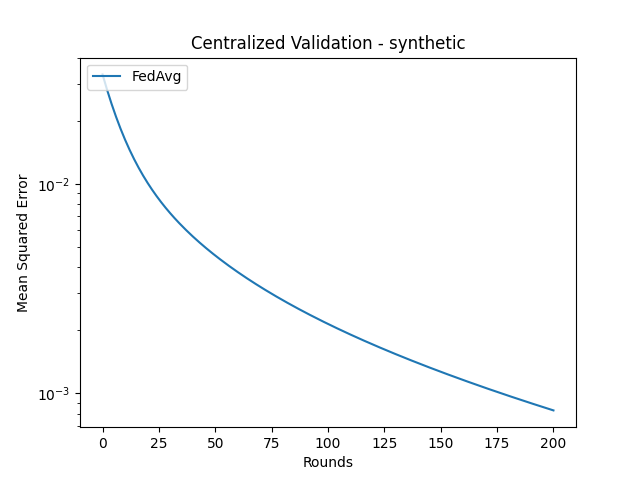
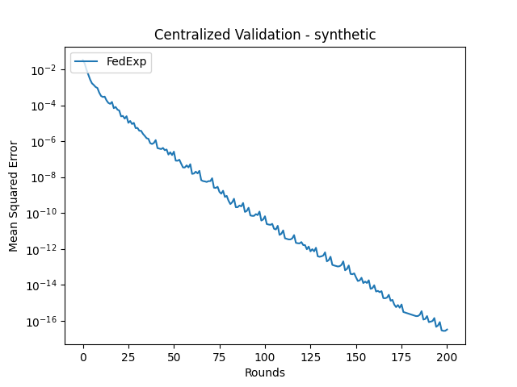

# FedExP: Speeding Up Federated Averaging via Extrapolation

The following baseline replicates the experiments in _FedExP: Speeding Up Federated Averaging via Extrapolation_, which explores the use of various server-side optimisers for different datasets, and how they compare to a newly suggested optimiser FedExp.

**Paper Abstract:**

<center>
<i>Federated Averaging (FedAvg) remains the most popular algorithm for Federated
Learning (FL) optimization due to its simple implementation, stateless nature, and
privacy guarantees combined with secure aggregation. Recent work has sought to
generalize the vanilla averaging in FedAvg to a generalized gradient descent step
by treating client updates as pseudo-gradients and using a server step size. While
the use of a server step size has been shown to provide performance improvement
theoretically, the practical benefit of the server step size has not been seen in most
existing works. In this work, we present FedExP, a method to adaptively determine the server step size in FL based on dynamically varying pseudo-gradients
throughout the FL process. We begin by considering the overparameterized convex
regime, where we reveal an interesting similarity between FedAvg and the Projection Onto Convex Sets (POCS) algorithm. We then show how FedExP can be
motivated as a novel extension to the extrapolation mechanism that is used to speed
up POCS. Our theoretical analysis later also discusses the implications of FedExP
in underparameterized and non-convex settings. Experimental results show that
FedExP consistently converges faster than FedAvg and competing baselines on
a range of realistic FL datasets.
</i>
</center>

**Paper Authors:**

Divyansh Jhunjhunwala, Shiqiang Wang, Gauri Joshi.

Note: If you use this implementation in your work, please remember to cite the original authors of the paper.

**[Link to paper.](https://arxiv.org/pdf/2301.09604.pdf)**

## Currently implemented

We have currently implemented the following experiments:

| Dataset          | Model            | Strategies                          |
| ---------------- | ---------------- | ----------------------------------- |
| SYNTHETIC        | LinearRegression | FedAvg, FedExP, FedAdagrad, FedProx |
| Federated EMNIST | EMNIST CR CNN    | FedAvg, FedExP, FedAdagrad, FedProx |
| CIFAR10          | ResNet18         | FedAvg, FedExP, FedAdagrad, FedProx |
| CIFAR100         | ResNet18         | FedAvg, FedExP, FedAdagrad, FedProx |

The implementations for the CIFAR datasets are very similar to those in the **Adaptive Federated Optimization** baseline, however the client has been changed to make the training procedure described in this paper.

### EMNIST CR CNN

This is the CNN described for character recognition in the EMNIST dataset as described in **Adaptive Federated Optimization** [Link To Paper](https://arxiv.org/pdf/2003.00295.pdf), a table is below describing the model used

| Layer     | Output Shape | # of Trainable Parameters | Activation | Hyperparameters                |
| --------- | ------------ | ------------------------- | ---------- | ------------------------------ |
| Input     | (28,28,1)    | 0                         |            |                                |
| Conv2d    | (26,26,32)   | 320                       | ReLU       | kernel size = 3; strides=(1,1) |
| Conv2d    | (24,24,64)   | 18496                     | ReLU       | kernel size = 3; strides=(1,1) |
| MaxPool2d | (12,12,64)   | 0                         |            | pool size = (2,2)              |
| Dropout   | (12,12,64)   | 0                         |            | p = 0.25                       |
| Flatten   | 9216         | 0                         |            |                                |
| Dense     | 128          | 1,179,776                   | ReLU       |                                |
| Dropout   | 128          | 0                         |            | p = 0.5                        |
| Dense     | 62           | 7998                      | softmax    |                                |

More experiments to be added soon.

## Running experiments

Experiments are organized by dataset under the `conf` folder using [hydra](https://hydra.cc/docs/tutorials/), e.g. `conf/cifar10` for the CIFAR10 dataset.
Each dataset contains a `config.yaml` file containing common setup variables and a `strategy` subfolder with different strategy parameters.

You can run specific experiments by passing a `conf` subfolder and a given `strategy` as follows.

```sh
python main.py --config-path conf/cifar10 strategy=fedexp
```

Otherwise, you can choose to run multiple configurations sequentially as follows:

```sh
python main.py -m --config-path conf/cifar10 strategy=fedexp,fedadagrad,fedprox,fedavg
```

Results will be stored as timestamped folders inside either `outputs` or `multiruns`, depending on whether you perform single- or multi-runs.

### Example outputs Synthetic

To help visualize results, the script also plots evaluation curves. Here are some examples:

<center>


</center>
